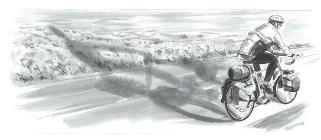

####Colorado, Father's day, June 15, Kremmling.

 Awaking to my 4 A.M. alarm, I'm soon on the road. The orangish glow on the eastern horizon hints of the day to come, and the almost-full moon to the southwest hangs above the 2000-foot canyon carved there by the Colorado River. Outside town, the intense aroma of sage is intoxicating, as are the sounds of all that I hear: swallows singing on the wing, a mountain bluebird too; in what must be a wetland just off the road are yellow warblers, song sparrows, red-winged and yellow-headed blackbirds. Snipe winnow overhead. 

I pedal on, slowly, savoring the now. The sage glows in the moonlight, and rising from the glow is a symphony of Brewer's sparrows and sage thrashers. The sparrow territories are small, with at least five birds always within earshot, all in wild dawn song. I pick out an individual beside the road as I slowly approach, hearing him work through high-pitched buzzes and trills and insect-like zeets, then cascade down to a long series of varied trills, then half a minute later rise again for another cycle. Their voices mix and mingle, and at any given instant some are near and loud, some far and soft, some high and some low, some clear and musical, others raspy and buzzy, their collective voices mesmerizing. 

And the thrashers! What remarkable singers, but their territories are far larger, and I pass only one for every ten sparrows. Each races through his repertoire of hundreds of different sounds (about 700 in one bird I studied carefully), every half second (0.57 seconds to be exact, on average) hustling on to another sound at break-neck speed. And I hear their mimicry—how they love meadowlarks and Brewer's sparrows. They too are a package singers, favoring one set of songs for a time before moving on to others, though it takes hours (at least eight) rather than minutes for him to tell all he knows.
 
Vesper sparrows, rock wrens, western meadowlarks, magpies, nighthawks, horned larks ... and there, 5:10 A.M., 25 minutes before sunrise, the first Brewer's sparrow switches to his daytime song, a simple two-parted affair, _zree zree zrrr-zrrr-zrrr_, with no hint of the pre-dawn maestro. With two such different personalities, who would have known it's the same species.

I take the advice from a roadside savannah sparrow, _take     take    take   take-it eeeeeeeaaasssssssyyyyyyy_. Ten seconds later, now well behind me, he repeats the wisdom in his lazy, high-pitched, almost insect-like song.

