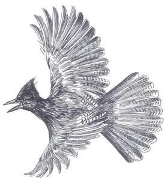
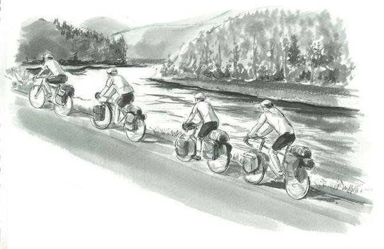

####Idaho, June 30.

 West of the Lolo Pass divide between Montana and Idaho, drops and trickles and rivulets from the watershed here soon merge to form a roaring river that we swoop down to meet. A rainbow flies across the road in front of me, a male western tanager, the red and yellow and black and white aglow in the rays of the early morning sun shining over my shoulder. And a Steller's jay, shook shook shook he calls, flying so close I see the details, the black crest and head giving way to a sky blue belly, a grayish back, the deep, rich blue of the wings flashing with each stroke; in this light, he's radiant, iridescent even, the birds here as colorful as found in any lush rainforest, as if to remind us that we are no longer in the rain shadow of the Bitterroots. 
 
 

In a flash we cover the ten miles to a stand of old-growth western red cedars that tower over the road. "_THIS IS THE WEST_," they shout, "_the home of trees tall beyond measure, of cedars and redwoods and sequoias and Doug firs and more_." 

And the home of special birds. From somewhere deep in these cedars, a varied thrush sings. I have marveled at these songs on my computer, where I've played endlessly, slowing them down and speeding them up, listening to long sequences and trying to comprehend the overall effect. I follow along now, the first song high and buzzy; the next is lower pitched, more tonal; next he's high again; always, successive songs are different, the contrast striking. He plays with only four different songs, but each is actually two in one, because he sings two different songs simultaneously with his two voice boxes. "Try whistling and humming at the same time," I suggest to David, "and you get the effect." I listen on, smiling, the effect all the better knowing that Meriwether Lewis first heard and described these varied thrushes near here two hundred years ago. 

