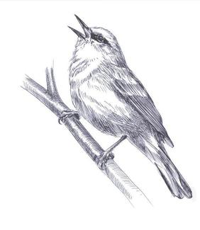

####Kentucky, May 16, Pippa Passes to Booneville.

 A little after 5 A.M., we ride through Alice Lloyd College on Purpose Road, crossing Integrity Lane, then Faith Avenue, then Action, Character, Conscience, Perseverance, Courage, Consecration. At each intersection, in the lighted bubble of a streetlight, are dawn-singing robins and phoebes and cardinals, each getting a jump on their singing day. Beyond the college, silence reigns, except for barking dogs, crowing roosters ... the _you-allllllllll_ of a female barred owl. 

All around us warblers announce the dawn: blue-wings stutter a _tsi tsi tsi tsi tsi tis tsi zweeeeeeeeeeee ti ti ti_; black-and-whites squeeze out a few thin, rapid _wese wese_ notes, then drop to lower notes before ending high; parulas swirl skyward with a complex buzzy song. Each yellow works through a dozen different "_sweet_" songs; redstarts bounce among two to four songs; hoodeds sing with the same clear quality of their one _tawee tawee tawee TEE-o_ daytime song, but each song now feels more jumbled, and successive songs are always different. Each warbler in his own excited voice, each in his own way, but on one matter they all agree: All airtime  between songs must be filled with emphatic chipping. 

About sunrise I hear the mood shift. Blue-wings offer their lazy _beee-bzzzzzzzzz_ daytime song, black-and-whites their deliberate _weesee-weesee-weesee_, parulas their simpler daytime song as well. Now each yellow, redstart, and hooded delivers only his one special song that he's saved for once the dawn wave has passed. 

