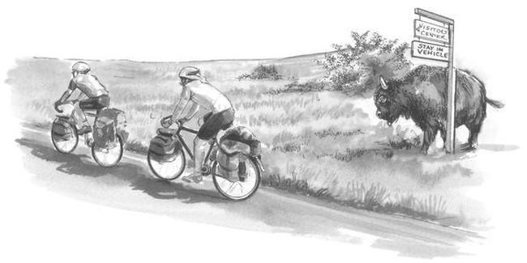

####Missouri, June 2, Prairie State Park. 

Yesterday, we bicycled down gravel NW 150th Lane into the heart of the Park; a vast blue sky welcomed us, extending to the horizon in all directions, with prairie flowers and songbirds and bison escorting us through pristine tallgrass prairie that had never seen a plow. 

Come dawn, I'm out of the campground and into the prairie ... standing beside an isolated bush from which a Bell's vireo sings. I listen, recalling the few facts I know of his kind. Has maybe half a dozen different songs. Typically alternates two or three different songs, clearly heard by how distinctively some song endings rise and some fall. I listen for a recognizable song, knowing that it may occur 15-20 times among 50 or so songs over a few minutes, and then it will disappear, returning minutes later ... Yes, I hear all that. He's a "package singer," like chats and robins, like yellow-throated and blue-headed vireos, as he bundles certain of his songs together during his performance.

Dickcissels, each male perfectly in tune with the local dialect. _Tup tup tup see-up sup sup_, I hear, so different from the other dialect just down the road.

Cowbirds and meadowlarks and grasshopper sparrows and ... Henslow's sparrows! This is the Prairie, home of Prairie Birds! In a flight of fancy, I _am_ a Henslow's sparrow, delivering my own unique _tsi-lick_ song, beginning high, dipping and then climbing again, feinting, jogging, warbling briefly, pausing, resuming precipitously lower, on and on, each dip and jog and feint lasting no more than 1/100th of a second, the entire cascade of notes in my high-speed roller coaster song beginning near 10 kHz and ending at 3, lasting a glorious half second. 

Back in the campground a special treat awaits: chickadees. On the hybrid zone here, the chickadees are all mixed up, most songs a combination of Carolina and black-cap traits. 

