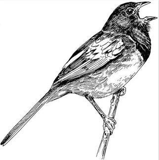
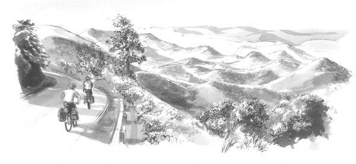

####Virginia, May 9, a Blue Ridge dawn. 

An hour before sunrise, the rain magically stops as we ease up the ramp to the Parkway just above Afton. White beacons of dogwood blooms line the way as we glide past whip-poor-wills jarring the night, when a roadside bush announces the day with a tentative _chewink_. A towhee, I smile. Others join in, with calling and fragmented singing, _drink_ ... _chewink_ ... _teeeeeee_ ... _your_ ... _chewink_ ... _drink teeeeee_ ..., successive calls and song bits all jumbled. In their dawn frenzy is no hint of the laid-back, repetitive singing they’ll use later in the day. 

_Whit-whit_, wood thrushes awake, their two-voiced singing one of the wonders of eastern woodlands. And _chip-burr_, the call of a scarlet tanager from the canopy, followed by disjointed dawn song, the phrases delivered haltingly, punctuated every dozen or so by another _chip-burr_. For 40 minutes the wave of dawn light and song will pass, sweeping west to the Pacific, and we ride the wave, racing down the steep grades, slowing to a crawl on the uphills, all the while feasting on the dawn singing of ... chipping sparrows sputtering their songs from the ground ... lingering woodcocks skydancing overhead ... field sparrows chipping madly between complex songs three times the length of their normal daytime bouncing ball song ... 

