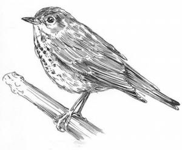

####Wyoming, June 19-20. 

A few miles south of Dubois, we bicycle through a surreal wonderland of geologic history: The red, iron-rich sands and shales tell of warm climates during the Age of Reptiles, and the purple and black layers above them are from the Cretaceous, about 150 million years ago _when birds were born_!

At the entrance to the Tetons, for the better part of an hour we are overwhelmed by lightning and thunder and rain and wind. After the storm passes, we emerge from our aspen grove shelter and set out again, now in a calm, gentle rain, the sun shining magically through the parting thunderheads. Rounding the southern end of Jackson Lake, among the fir and spruce, we are buoyed by a symphony of Swainson's thrushes. The songs swirl and spiral upward, each breathy phrase higher and longer and louder than the one before, the entire performance as if lifting up so many spirits to the heavens. We bike from one singing male to the next, each of them seemingly singing "_pass it on_," until we break out into the open sage and grassland on our approach to Jenny Lake itself. 

